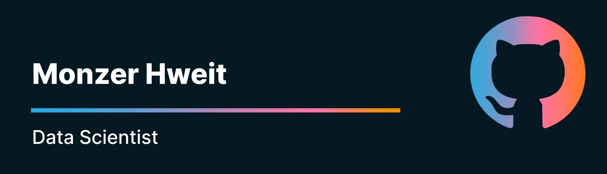

<!-- Banner 

  

-->

#  Hi there 👋 I'm Monzer Hweit

🚀 **Data Scientist | AI Developer | Machine Learning | Lifelong Learner**

Welcome to my GitHub profile! I'm Monzer Hweit. Passionate Data Scientist with a strong foundation in machine learning, data mining and visualization.

## 💻 Tech Stack

## 🌐 Social

  
  

## 📊 Stats

  

  

